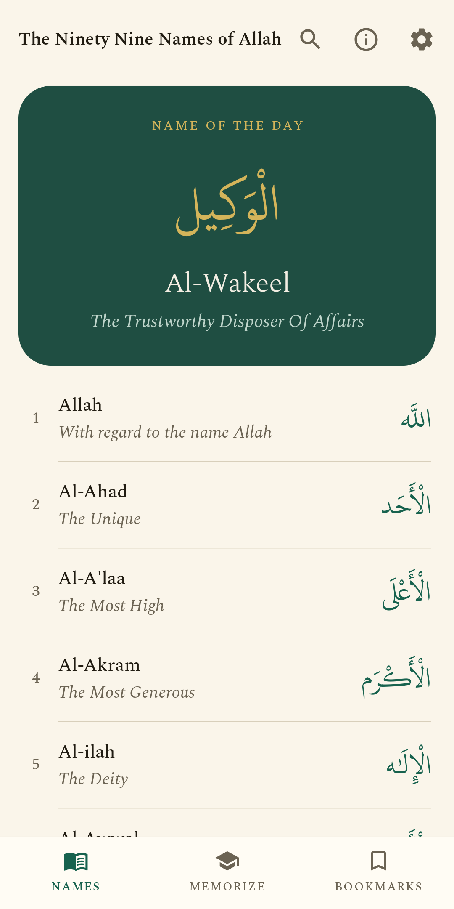
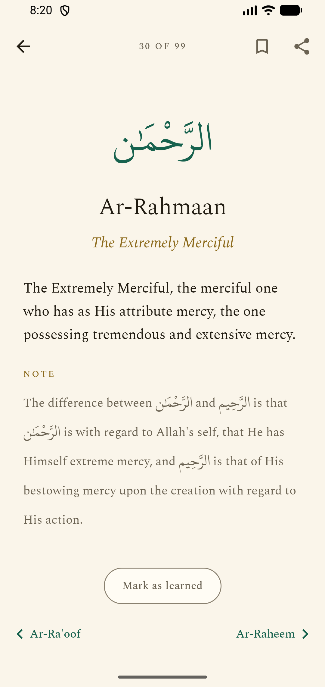
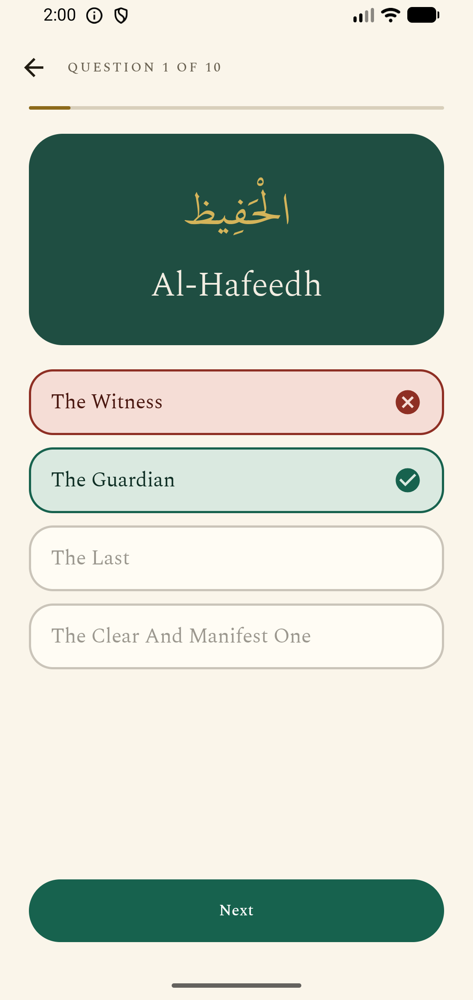
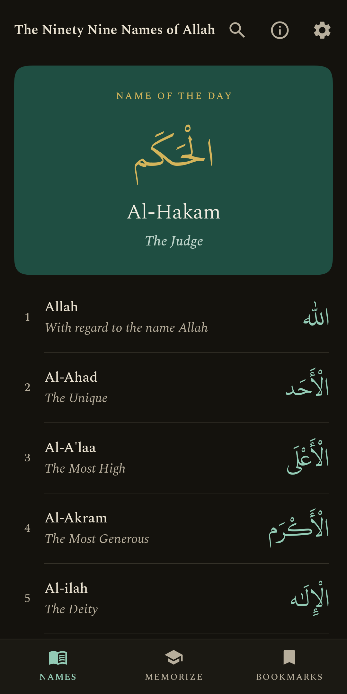

# Ninety Nine

A free, open-source, native Android app for reading and memorizing Al-Asma ul-Husna — the ninety nine names of Allah — with Arabic, transliteration, and meanings.

Based on the lecture of Sheikh Ibn Uthaymeen (Rahimahullah), as presented in *"The Ninety Nine Names of Allah: A Memorisation Tool with Transliteration and Meanings"*. Content curated at [muntasimulhaque.bearblog.dev/99-names](https://muntasimulhaque.bearblog.dev/99-names/).

  
  
  
  

## Features

- **Read** — all 99 names with Arabic script set in KFGQPC Uthmanic Script HAFS — the typeface of the Madinah Mushaf — with transliteration and full meanings, plus scholarly notes (e.g. the distinction between Ar-Rahmaan and Ar-Raheem). Browse the list, swipe between names, and search by name, meaning, or number.
- **Keep** — bookmark the names you turn to and find them together in their own tab, in the order they appear in the book. Separate from memorization: resetting your progress leaves your bookmarks alone.
- **Share** — turn any name into a beautifully rendered card (Arabic, transliteration, meaning) and share it as an image.
- **Memorize** — flashcards with a flip animation and an "I know it / Still learning" loop, a ten-question quiz with a remembered best score, and a quiet progress count (no streaks, no gamification).
- **Daily** — a "Name of the Day" that rotates deterministically through all 99, shown on the home screen, as an optional notification at a time you choose, and as a resizable home-screen widget in the app's emerald-and-gold livery.
- **Considered** — warm paper light theme, dark, and true-black AMOLED; adjustable text size; quiet haptics; bundled KFGQPC Uthmanic Script HAFS (Arabic) and Spectral (Latin) typefaces; predictive back; edge-to-edge.
- **Pure** — 100% offline. No ads, no analytics, no tracking, no network permission. The only permission is notifications, and only if you turn the daily name on.

## Found a mistake in the content?

Please say so — it is far more use as an issue than as a review. Open a
[content correction](https://github.com/muntasimulhaque/ninetynine/issues/new?template=content-correction.yml)
with the name's number (the figure to its left in the list), what the app
shows, and what it should say. From inside the app, About → Send feedback
opens an email instead.

Transliteration in particular has no single correct convention, and this app
follows its source rather than standardising it — so if a spelling looks wrong
to you, it is worth saying which convention you are going by.

## Building

1. Open the project in Android Studio (Meerkat or newer), or run `./gradlew assembleDebug` — the wrapper is committed, so nothing needs installing first.
2. Run on a device or emulator (minimum Android 7.0, API 24).
3. For a release build: **Build → Generate Signed App Bundle**.

Unit tests run with `./gradlew testDebugUnitTest`: the daily-name rotation, quiz
generation, search, deck building, and a guard over `assets/names.json` itself —
that it holds 99 sequential entries, no blank or duplicate fields, NFC-normalized
Arabic, and not one character the bundled Mushaf typeface cannot draw.

## Architecture

Single-module Kotlin app. Jetpack Compose + Material 3 with a small design system (theme, type scale, shared components), Navigation Compose with activity- and screen-scoped ViewModels, DataStore for progress and settings, WorkManager for the daily schedule, Glance for the widget, kotlinx.serialization for the bundled `assets/names.json`. No DI framework, no database — the content is a static JSON asset, which also makes translations straightforward (swap the asset per locale).

## License

**The code is MIT** — see [LICENSE](LICENSE). Take it, build on it, ship it.

**The content is not ours to license.** The text in `app/src/main/assets/`
(`names.json`, `intro.txt`) is reproduced from the lecture of Sheikh Ibn
Uthaymeen (Rahimahullah) as presented in the book named above. It is included
here for the benefit of anyone seeking to learn the names, with attribution
intact — the MIT grant covers the software around it, not that text.

One deliberate departure: the source's transliteration is inconsistent with
itself in eight places — a doubled consonant left single, a long vowel written
short — and those eight have been regularised to the convention the source
follows everywhere else (#28, #32, #44, #48, #80, #87, #94, #95). Nothing else
in the text has been altered.

**Bundled fonts** are under their own terms: Spectral under the SIL Open Font
License, and KFGQPC Uthmanic Script HAFS distributed free by the King Fahd
Glorious Quran Printing Complex and bundled unmodified — its license permits
use, copying and distribution but not modification or derivative artwork, so
the app's ٩٩ mark is drawn from Noto Naskh Arabic (OFL) instead. Both licenses
are in `app/src/main/assets/fonts/`.
